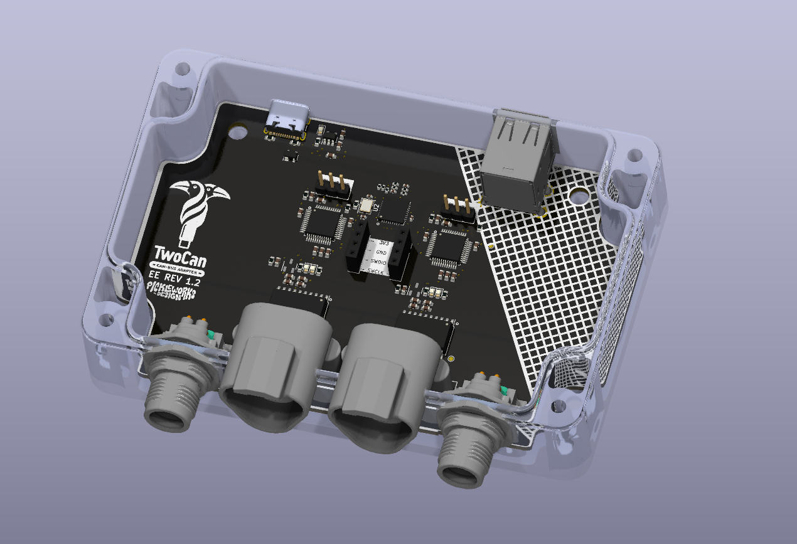

# TouCAN

Personal Project To integrate 2 Can Adapters in 1 board with Deutch DT 3pin connectors and an onboard usb HUB

USB to Can Adapter

This Project is Based on the CANAble USB to Canbus adapter project https://github.com/makerbase-mks/CANable-MKS/tree/main/Hardware/MKS%20CANable%20V2.0

